# The Wild Oasis

<div align="center">
<a href="https://the-wild-oasis-rouge-five.vercel.app" alt="The Wild Oasis">

<a>
</div>

## Usage

```bash
$ git clone https://github.com/heliohdd/the-wild-oasis.git
$ cd the-wild-oasis
$ npm install
$ npm run dev
```

Click the following link [➡️ http://localhost:5173](http://localhost:5173/ "The Wild Oasis") or run the project on a web browser using the `http://localhost:${port number}` address showed on the line `Local:` on your screen.

<div align="center">
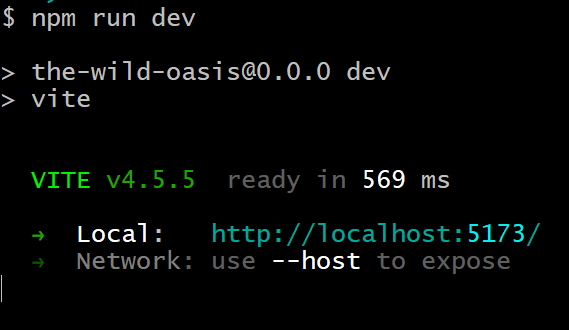
</div>

**Tip:** `Ctrl + click` in the address showed in your screen.

## Introduction

"The Wild Oasis" is a small boutique hotel with 8 luxurious wooden cabins that can be extended.

The hotel need a custom-build application to manage everything about the hotel such as bookings, cabins and guests.

This is the internal application used inside the hotel to check in guests as they arrive and control all the informations about the check out and statistics datas.

This is a full stack application that is composed of frontend, backend API with a supabase database and is integrated with a customer-facing website that allows the reservations by the users throw a personal account, where customers will be able to book stays, using the same API.

## Project Requirements From the Business

1. Users of the app are hotel employees. They need to be logged into the application to perform tasks
1. New users can only be signed up inside the applications (to guarantee that only actual hotel employees can get accounts)
1. Users should be able to upload an avatar, and change their name and password
1. App needs a table view with all cabins, showing the cabin photo, name, capacity, price, and current discount
1. Users should be able to update or delete a cabin, and to create new cabins (including uploading a photo)
1. App needs a table view with all bookings, showing arrival and departure dates, status, and paid amount, as well as cabin and guest data
1. The booking status can be “unconfirmed” (booked but not yet checked in), “checked in”, or “checked out”. The table should be filterable
   by this important status
1. Other booking data includes: number of guests, number of nights, guest observations, whether they booked breakfast, breakfast price
1. Users should be able to delete, check in, or check out a booking as the guest arrives (no editing necessary for now)
1. Bookings may not have been paid yet on guest arrival. Therefore, on check in, users need to accept payment (outside the app), and
   then confirm that payment has been received (inside the app)
1. On check in, the guest should have the ability to add breakfast for the entire stay, if they hadn’t already
1. Guest data should contain: full name, email, national ID, nationality, and a country flag for easy identification
1. The initial app screen should be a dashboard, to display important information for the last 7, 30, or 90 days:
   1. A list of guests checking in and out on the current day. Users should be able to perform these tasks from here
   1. Statistics on recent bookings, sales, check ins, and occupancy rate
   1. A chart showing all daily hotel sales, showing both “total” sales and “extras” sales (only breakfast at the moment)
   1. A chart showing statistics on stay durations, as this is an important metric for the hotel
1. Users should be able to define a few application-wide settings: breakfast price, min and max nights/booking, max guests/booking
   1.App needs a dark mode

## Technology & Tools

<p align="center">
   
   
   
   
   
   
</p>

- Styled Components
- React Query
- Context API
- React Hook Form
- React icons/React hot toast/Recharts/date-fns/Supabase

## Structure of the application

As this application is used internally as tool inside a company, that are entirely hidden behind a login it was used to build a Single-Page-Application and this application is composed of 8 pages that represents 7 features categories as listed below:

1. Login
1. Dashboard
1. Bookings
1. Booking check in
1. Cabins
1. User sign up
1. App settings
1. Account settings

### 1. Login

<div align="center">
   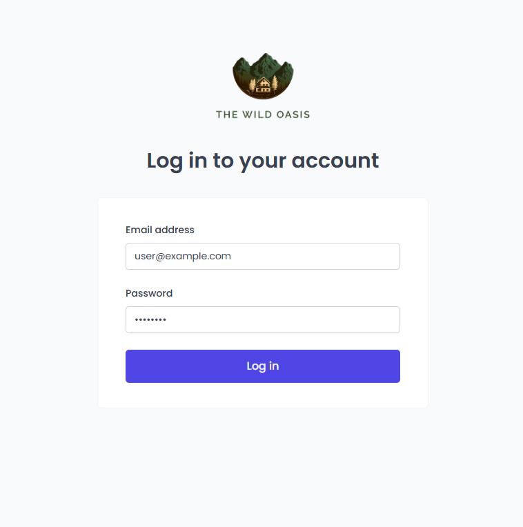
</div>

In this page use e-mail `user@example.com` and password `12345678` to login.

### 2. Dashboard

<div align="center">
	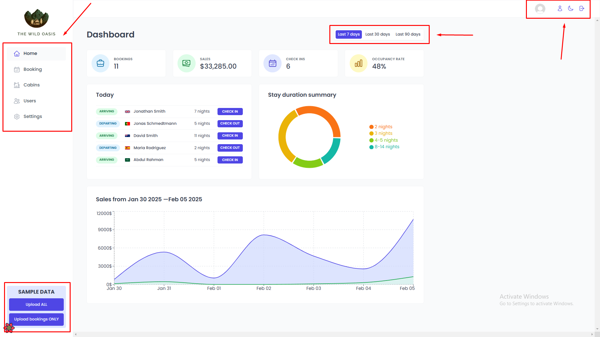
</div>

The dashboard is presented with a list of occupants who will occupy and those who will vacate the rooms on the day, as well as information about the generated value, how many check-ins and the occupancy rate in the chosen period of 7, 30 or 90 days.

Highlighted on the left side at the top is the navigation menu for reservations, list of available rooms, user control and the app configuration.

On the right side in the upper right-hand corner there are buttons for logout, dark/light mode and user information update.

On the left side in the bottom are the SAMPLE DATA buttons to update the test data in the database.

### 3. Bookings

<div align="center">
	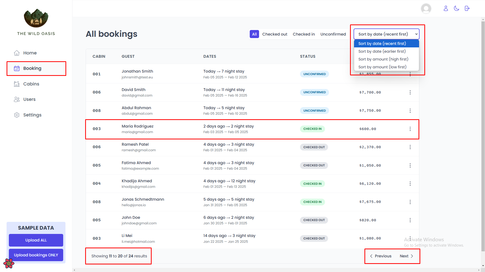
</div>

List of all occupants with possible filters to generate a list only those who checked out, only those who checked in, those who have not yet confirmed the reservation, and it can still be ordered by date of occupancy as for the value generated by the rental.

#### Context Menu

<div align="center">
	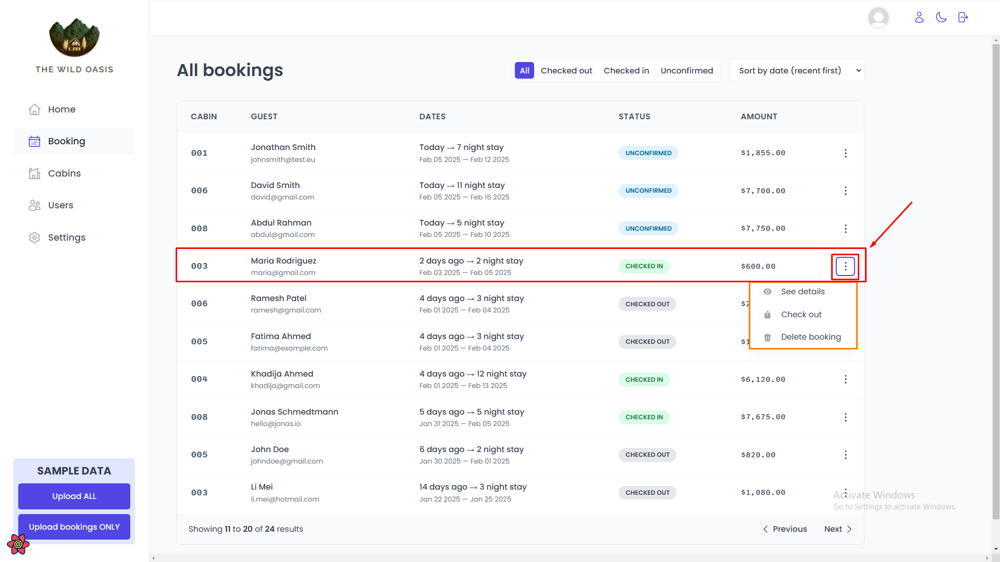
</div>

For each reservation is recorded the room number, the name and email of the user, the period of occupancy, the status of the reservation and the amount generated by the reservation.

Each registration brings in the last column a context menu represented by three dots that allows you to navigate to the reservation details page, to perform the booking check out operation, and also for removal of this reservation registration.

### 4. Booking Check in

<div align="center">
	
</div>

On the page with the details of the reservation are shown the information as amount to be paid, the status of the payment, the number of the reservation, and some observation as food restriction or that will be taken some pet for example, with the options of making the check out, the removal of the registration and the return to the page listing the reservations made.

<div align="center">
	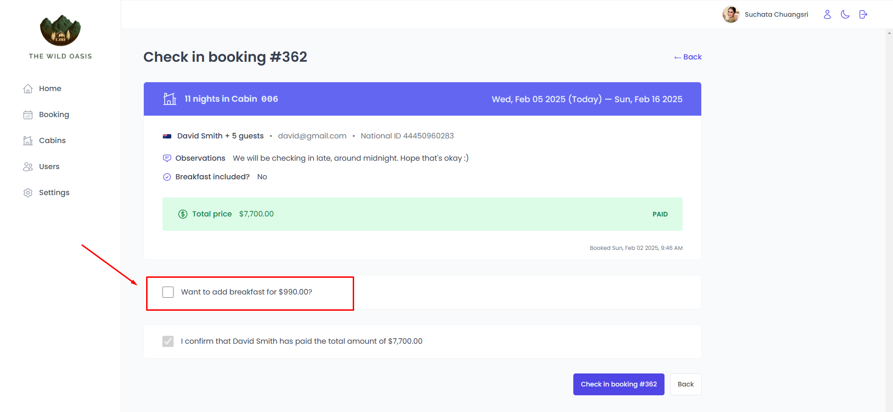
</div>

For customers who will check in without having included the coffee service, is presented the option to include the service with amount to be added according to number of people and days booked and it can be paid together with the reservation, or if the reservation has already been paid, the customer pays only the additional for coffee service.

### 5. Cabins

<div align="center">
	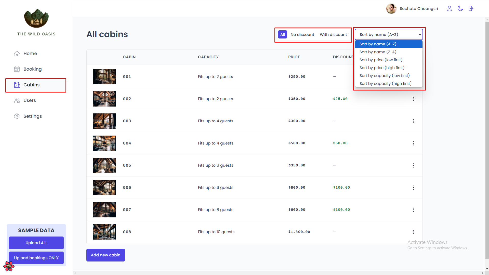
</div>

The list of rooms to be allocated is presented with photo, identification, capacity, price, discount and context menu.

The list can be of all rooms, of the rooms without discount and those that have discount. They can also be ordered in ascending or descending order by name, price or occupancy capacity.

<div align="center">
	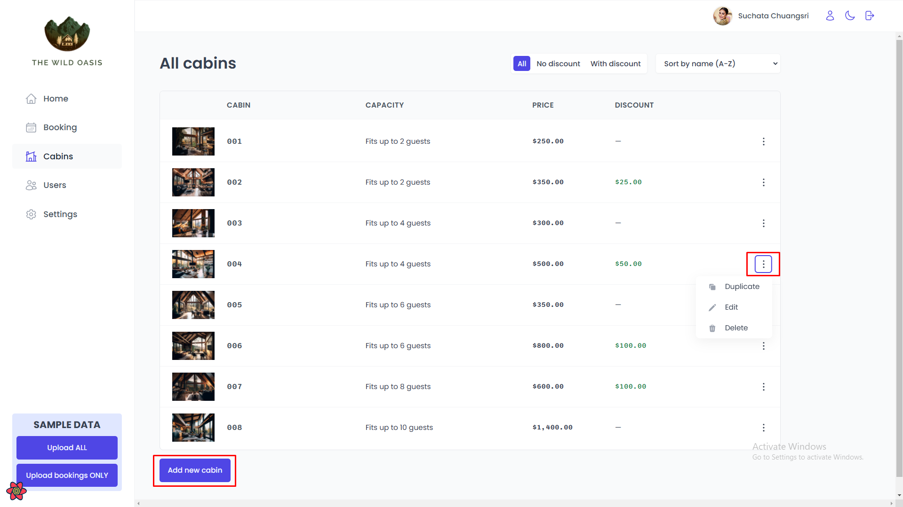
</div>

The context menu brings the option to duplicate to create a new room record, the option to edit to change some information and the option to remove the record from the listing.

For the option to duplicate must be used immediately after the option to edit to change some of the information for the new record generated.

<div align="center">
	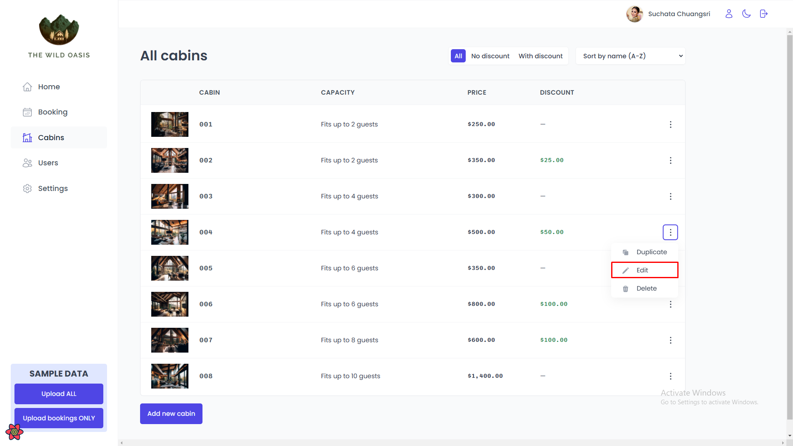
</div>

When using the option to duplicate is automatically generated the new record at the end of the list with a message indicating the creation of the new record successfully.

<div align="center">
	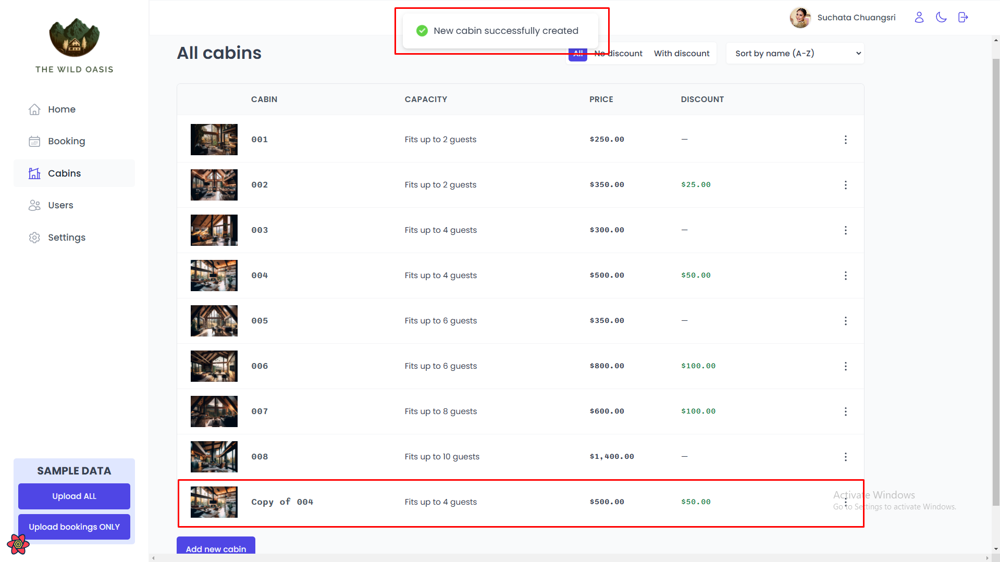
</div>

The option to edit allows the update of information regarding the room including the description to be presented on the site to be accessed by the customers themselves when booking through the public website.

<div align="center">
	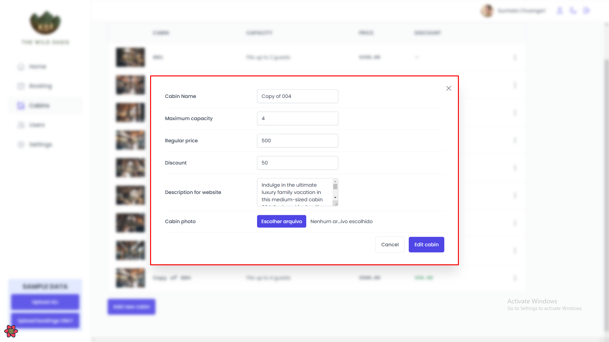
</div>

### 6. User sign up

<div align="center">
	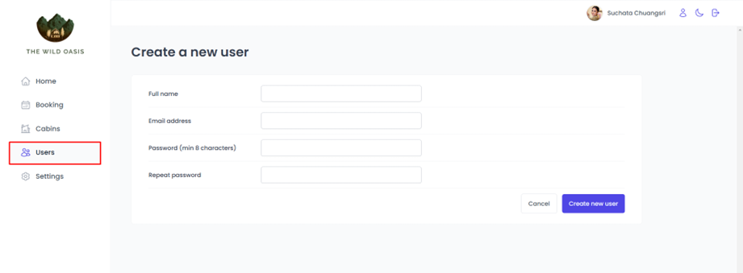
</div>

Screen for creating a new user who can access the management area of the hotel occupations.

### 7. App settings

<div align="center">
	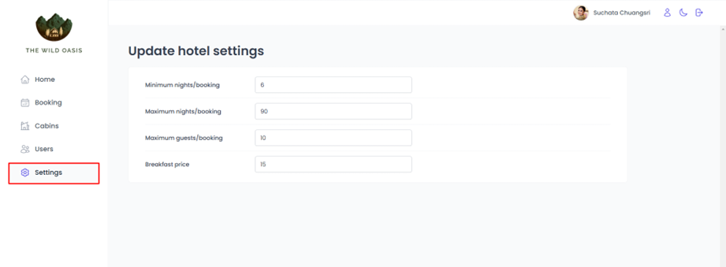
</div>

Screen for setting values and maximum and minimum amounts of days, occupants and the amount charged per person/day for coffee service.

### 8. Account settings

<div align="center">
	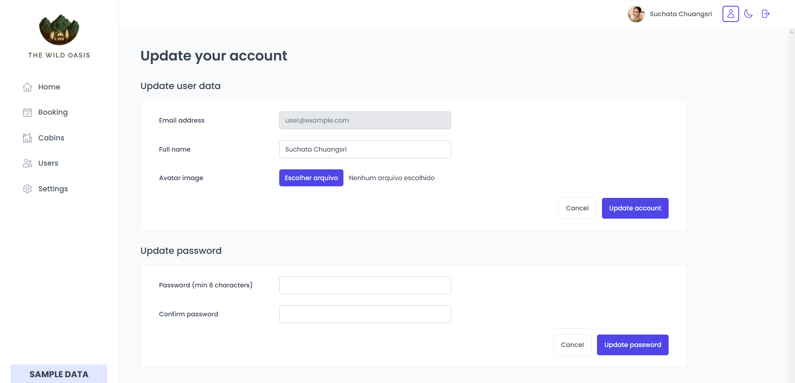
</div>

Screen for updating data about the user such as the name, the avatar image and also the password.
